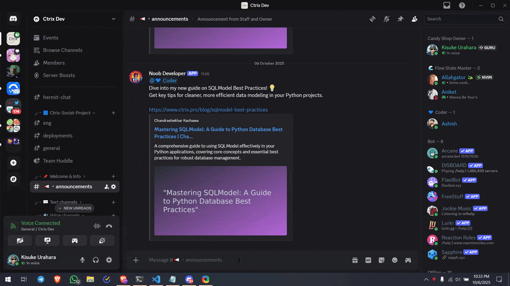

# Discord Webhook Manager

The Discord Webhook Manager is a powerful and intuitive platform designed to streamline and enhance how Discord server administrators and users manage their server announcements and messages. It eliminates the need for manual work, expensive paid bots, or complex custom bot development by providing a centralized, user-friendly interface for all your Discord messaging needs.

This project contains two main applications:
- **`apps/web`**: The Next.js frontend application providing the user interface.
- **`apps/backend`**: The Node.js (Fastify) backend API services.

## Problem Solved

Discord server administrators often face challenges when trying to send custom announcements with unique avatars and usernames. This typically requires:

*   **Manual Work**: Tediously creating and sending messages through webhooks for each announcement.
*   **Paid Bots**: Investing in premium bot services that offer custom messaging features.
*   **Custom Bots**: Developing and maintaining their own custom Discord bots, which can be time-consuming and require technical expertise.

The Discord Webhook Manager addresses these pain points by offering a free, convenient, and feature-rich alternative.

## Features

*   **Comprehensive Discord Webhook Management**: Create, view, edit, and delete Discord webhooks through a user-friendly interface.
*   **Custom Avatar and Username Support**: Design and save multiple custom avatars and define custom usernames for dynamic and engaging messages.
*   **Reusable Message Templates with Rich Embeds**: Create, store, and manage message templates, including rich embeds, for quick and consistent announcements.
*   **Intuitive Message Composer with Real-time Preview**: Compose messages easily with custom avatars, usernames, and embeds, and see a real-time preview of how they will appear on Discord.
*   **Secure User Authentication and Authorization**: Seamlessly manage user accounts with secure registration, login, and session management, likely integrated with Discord's OAuth.
*   **No-Code Solution**: Advanced Discord messaging accessible to everyone without any coding knowledge.
*   **Cost-Effective**: Eliminate the need for paid bot subscriptions or the overhead of custom bot development.
*   **User Settings and Preferences**: Manage various application settings and preferences specific to each user.

  

## 📈 Deployment

This project can be deployed to Vercel. For detailed deployment instructions, please refer to [DEPLOYMENT.md](./DEPLOYMENT.md).

## 🤝 Contributing

We welcome contributions to this project! Please see our [CONTRIBUTING.md](./CONTRIBUTING.md) for detailed guidelines on how to contribute, report bugs, and suggest features.

## 📄 License

This project is licensed under the GNU General Public License v3.0.

## 🆘 Support

If you encounter any issues or have questions:
<!-- 1.  Join our Discord server for community support: [https://discord.gg/YbtyTRAFv2](https://discord.gg/YbtyTRAFv2) -->
1.  Check the existing issues
2.  Create a new issue with detailed information
3.  Provide steps to reproduce the problem

---

If you find this project useful, please consider giving it a ⭐ on GitHub! Your support helps us grow and improve.

**Happy Coding! 🎉**